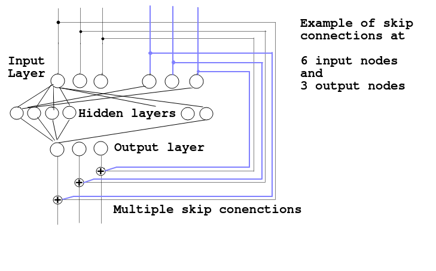

# Nerual_Netwok_CPP
Neural Network

Update with softmax

## Test residual_net.cpp
This network consist of 3 blocks, 3 fc_m_resnet object stacked on each other

    fc_m_resnet fc_nn_top_block;
    fc_m_resnet fc_nn_mid_block;
    fc_m_resnet fc_nn_end_block;

### Change Makefile to residual_net.cpp

    #SRCS = main.cpp fc_m_resnet.cpp simple_nn.cpp
    #PROG = main

    SRCS = residual_net.cpp fc_m_resnet.cpp 
    PROG = residual_net

 There are skip residual connection betwheen the input side of `fc_nn_end_block` and output side of `fc_nn_top_block` 
 to make a residual connection for not vanishing gradient esspecial if many mid blocks are stacked 
 
 The residual_net.cpp net seems to works and steady converge during training.
 The could be arbriatary size of input output nodes of all blocks even when use skip residual connection enabled
 `o_layer_delta`and `i_layer_delta` link the backpropagation between each `fc_m_resnet` object block 
 
 `use_skip_connect_mode = 1` enable skip residulal connections
 
 `block_type` set if the `fc_m_resnet` is a top, mid or end block. It is possible to stack many mid blocks with residual skip connections
 
 `fc_nn_end_block` and `fc_nn_top_block` dont have skip capability  
 
    input node --- [0] = 0.0325749
    Epoch 248
    input node [0] = 0.00308202
    Output node [0] = 5.69056e-11  Target node [0] = 0
    Output node [1] = 1.23192e-10  Target node [1] = 0
    Output node [2] = 5.05007e-08  Target node [2] = 0
    Output node [3] = 1  Target node [3] = 1
    Output node [4] = 1.01169e-12  Target node [4] = 0
    Output node [5] = 1.97978e-07  Target node [5] = 0
    Output node [6] = 5.45044e-15  Target node [6] = 0
    Output node [7] = 6.12513e-08  Target node [7] = 0
    Output node [8] = 1.33977e-07  Target node [8] = 0
    Output node [9] = 5.31416e-08  Target node [9] = 0
    Training loss = 104.309
    correct_classify_cnt = 59967
    correct_ratio = 99.945
    Epoch ----249
    input node --- [0] = 0.00308202
    Epoch 249
    input node [0] = 0.0845584
    Output node [0] = 7.38656e-15  Target node [0] = 0
    Output node [1] = 0.999995  Target node [1] = 1
    Output node [2] = 2.59181e-10  Target node [2] = 0
    Output node [3] = 1.09584e-13  Target node [3] = 0
    Output node [4] = 5.48093e-06  Target node [4] = 0
    Output node [5] = 2.14505e-12  Target node [5] = 0
    Output node [6] = 2.43188e-12  Target node [6] = 0
    Output node [7] = 8.15445e-09  Target node [7] = 0
    Output node [8] = 2.52214e-10  Target node [8] = 0
    Output node [9] = 1.81921e-13  Target node [9] = 0
    Training loss = 109.82
    correct_classify_cnt = 59964
    correct_ratio = 99.94
    Save data weights ...
    Save data finnish !
    Save data weights ...
    Save data finnish !
    Save data weights ...
    Save data finnish !
    Epoch ----250
    input node --- [0] = 0.0845584
 
 ## Examples of diffrent input / output skip connections of a mid block.
 
 Note that this is only ilustation of `fc_nn_mid_block` 
 You can stack arbitrary numbers of skip connected mid `fc_nn_mid_block`.
 `fc_nn_end_block` and `fc_nn_top_block` dont have skip capability. 
 

 
 ## Here trained on MNIST Fashion dataset not the downloaded MNIST digits 
 
    const int top_inp_nodes = MNIST_pix_size;
    const int top_out_nodes = 50;
    const int mid_out_nodes = 30;
    const int end_out_nodes = 10;
    const int top_hid_layers = 1;
    const int top_hid_nodes_L1 = 300;
    const int mid_hid_layers = 3;
    const int mid_hid_nodes_L1 = 50;
    const int mid_hid_nodes_L2 = 50;
    const int mid_hid_nodes_L3 = 30;
    const int end_hid_layers = 1;
    const int end_hid_nodes_L1 = 15;

### test structure of residual_net in MNIST_fasshion_weights

    olle@olle-TUF-Gaming-FX505DT-FX505DT:~/pytorch_cpp/t14/Nerual_Netwok_CPP$ ./residual_net 
    General Neural Network Residual net test Beta version under work...
    3 stackaed nn blocks with residual connections 
    file_size 7840016
    MNIST_file_size = 7840016
    train.. or t10k.. ..-images-idx3-ubyte file is successfully loaded in to MNIST_data[MN_index] memory
    file_size 10008
    train... or t10k...  ...-labels-idx1-ubyte file is successfully loaded in to MNIST_lable[MN_index] memory
    fc_m_resnet Constructor
    Seed radomizer done
    fc_m_resnet Constructor
    Seed radomizer done
    fc_m_resnet Constructor
    Seed radomizer done
    Fully connected residual neural network object
    fc_m_resnet object version : 0.0.7

     Number of hidden layers is set to = 1
    Size of hidden_layer[0][x] = 300
    hidden_layer vector is now set up
    Now setup all_weight, change_weights vectors size of this fc block
    Size of temporary dummy_1D_weight_vector from input layer connection[0] is = 785
    Size of temporary dummy_1D_weight_vector last hidden layer connection[0] is = 301
    The size of all_weight and change_weights in now setup OK !
    Note that the program how call this object could only set this size once. No protections against change size of the public vectors
    Setup state = 2
    Size of layer dimentions[] of weights at the this nn block = 2
    Size of node dimentions[][] of weights for hidden layer number 0 is: 300
    Size of weight dimentions[][][] of weights for hidden layer number 0 is: 785
    Size of node dimentions[][] of weights for hidden layer number 1 is: 50
    Size of weight dimentions[][][] of weights for hidden layer number 1 is: 301
    

     Number of hidden layers is set to = 3
    Size of hidden_layer[0][x] = 50
    ==== Skip connection is used ====
    input_layer.size() = 50
    output_layer.size() = 30
    skip_conn_multiple_part = 1
    skip_conn_rest_part = 20
    Size of hidden_layer[1][x] = 50
    Size of hidden_layer[2][x] = 30
    hidden_layer vector is now set up
    Now setup all_weight, change_weights vectors size of this fc block
    Size of temporary dummy_1D_weight_vector from input layer connection[0] is = 51
    Size of temporary dummy_1D_weight_vector from hidden layer connection[1] is = 51
    Size of temporary dummy_1D_weight_vector from hidden layer connection[2] is = 51
    Size of temporary dummy_1D_weight_vector last hidden layer connection[2] is = 31
    The size of all_weight and change_weights in now setup OK !
    Note that the program how call this object could only set this size once. No protections against change size of the public vectors
    Setup state = 2
    Size of layer dimentions[] of weights at the this nn block = 4
    Size of node dimentions[][] of weights for hidden layer number 0 is: 50
    Size of weight dimentions[][][] of weights for hidden layer number 0 is: 51
    Size of node dimentions[][] of weights for hidden layer number 1 is: 50
    Size of weight dimentions[][][] of weights for hidden layer number 1 is: 51
    Size of node dimentions[][] of weights for hidden layer number 2 is: 30
    Size of weight dimentions[][][] of weights for hidden layer number 2 is: 51
    Size of node dimentions[][] of weights for hidden layer number 3 is: 30
    Size of weight dimentions[][][] of weights for hidden layer number 3 is: 31

     Number of hidden layers is set to = 1
    Size of hidden_layer[0][x] = 15
    hidden_layer vector is now set up
    Now setup all_weight, change_weights vectors size of this fc block
    Size of temporary dummy_1D_weight_vector from input layer connection[0] is = 31
    Size of temporary dummy_1D_weight_vector last hidden layer connection[0] is = 16
    The size of all_weight and change_weights in now setup OK !
    Note that the program how call this object could only set this size once. No protections against change size of the public vectors
    Setup state = 2
    Size of layer dimentions[] of weights at the this nn block = 2
    Size of node dimentions[][] of weights for hidden layer number 0 is: 15
    Size of weight dimentions[][][] of weights for hidden layer number 0 is: 31
    Size of node dimentions[][] of weights for hidden layer number 1 is: 10
    Size of weight dimentions[][][] of weights for hidden layer number 1 is: 16
    Do you want to load weights from saved weight file = Y/N 
    
