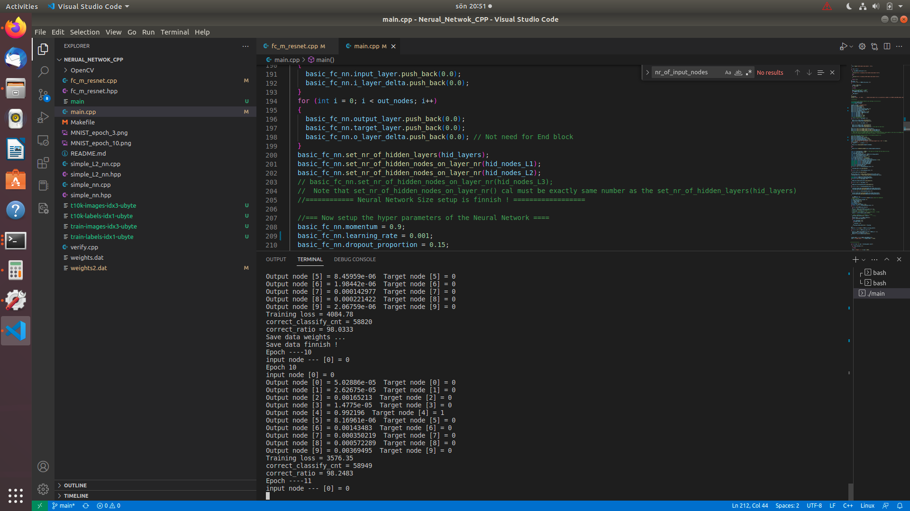
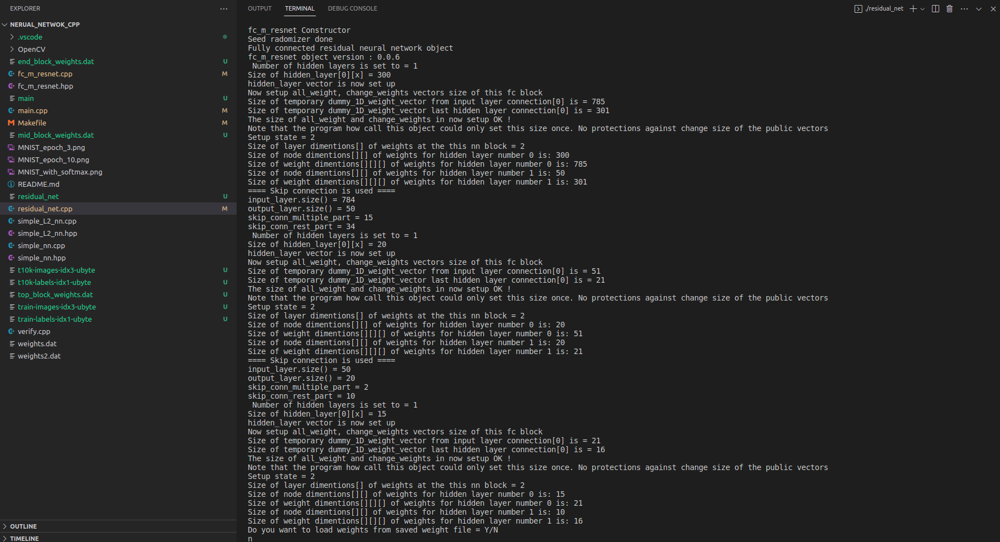

# Nerual_Netwok_CPP
Neural Network

Update with softmax

## Test residual_net.cpp
This network consist of 3 blocks, 3 fc_m_resnet object stacked on each other

    fc_m_resnet fc_nn_top_block;
    fc_m_resnet fc_nn_mid_block;
    fc_m_resnet fc_nn_end_block;

### Change Makefile to residual_net.cpp

    #SRCS = main.cpp fc_m_resnet.cpp simple_nn.cpp
    #PROG = main

    SRCS = residual_net.cpp fc_m_resnet.cpp 
    PROG = residual_net

 There are skip residual connection betwheen the input side of `fc_nn_end_block` and output side of `fc_nn_top_block` 
 to make a residual connection for not vanishing gradient esspecial if many mid blocks are stacked 
 
 The residual_net.cpp net seems to works and stady converge during training.
 The could be arbriatary size of input output nodes of all blocks even when use skip residual connection enabled
 `o_layer_delta`and `i_layer_delta` link the backpropagation betwheen each `fc_m_resnet` object block 
 
 `use_skip_connect_mode = 1` enable skip residulal connections
 
 `block_type` set if the `fc_m_resnet` is a top, mid or end block. It is possible to stack many mid blocks with residual skip connections
 
 `fc_nn_end_block` dont have skip capability yet in version 0.0.6 will be added later 
 
    Epoch ----7
    input node --- [0] = 4
    Epoch 7
    input node [0] = 3.99999
    Output node [0] = 1.77957e-12  Target node [0] = 0
    Output node [1] = 0.996692  Target node [1] = 1
    Output node [2] = 0.000245848  Target node [2] = 0
    Output node [3] = 5.00665e-06  Target node [3] = 0
    Output node [4] = 2.49884e-06  Target node [4] = 0
    Output node [5] = 3.09979e-11  Target node [5] = 0
    Output node [6] = 8.42957e-12  Target node [6] = 0
    Output node [7] = 0.00284546  Target node [7] = 0
    Output node [8] = 0.000163695  Target node [8] = 0
    Output node [9] = 4.53285e-05  Target node [9] = 0
    Training loss = 20016.3
    correct_classify_cnt = 54752
    correct_ratio = 91.2533
    Epoch ----8
    input node --- [0] = 3.99999

