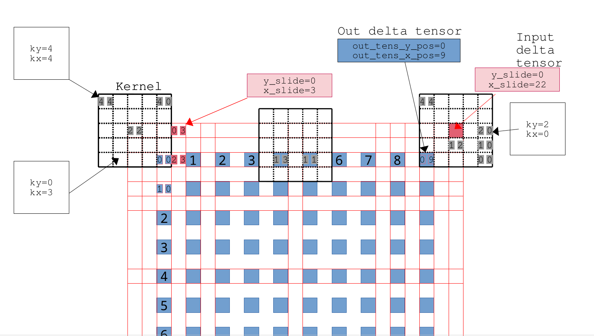
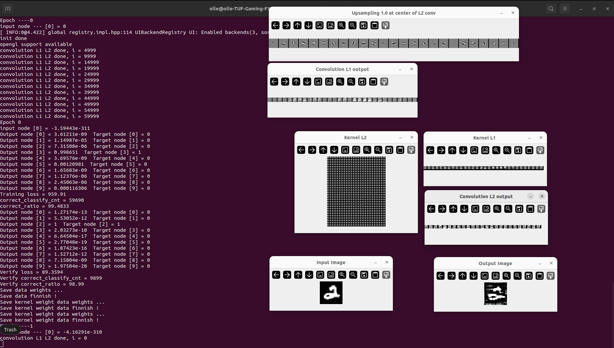
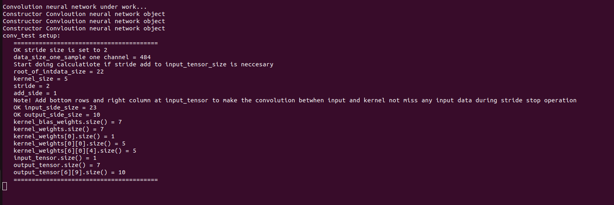

# C++ Convolution Neural Network and Residual fully connected Neural Network
Neural Network
Youtube
Convolution Neural Network
https://www.youtube.com/watch?v=daEph4x4RTc

Residual Fully connected Neural Network
https://www.youtube.com/watch?v=nnH4r4lRVmo&t=146s

Update with softmax

## Test residual_net.cpp
This network consist of 3 blocks, 3 fc_m_resnet object stacked on each other

    fc_m_resnet fc_nn_top_block;
    fc_m_resnet fc_nn_mid_block;
    fc_m_resnet fc_nn_end_block;

### Change Makefile to residual_net.cpp example

    #SRCS = main.cpp fc_m_resnet.cpp simple_nn.cpp
    #PROG = main

    SRCS = residual_net.cpp fc_m_resnet.cpp load_mnist_dataset.cpp 
    PROG = residual_net

    #SRCS = verify.cpp fc_m_resnet.cpp simple_nn.cpp
    #PROG = verify
   
 ## Here trained on MNIST digits
    
    const int top_inp_nodes = data_size_one_sample;
    const int top_out_nodes = 100;
    const int mid_out_nodes = 30;
    const int end_out_nodes = 10;
    const int top_hid_layers = 1;
    const int top_hid_nodes_L1 = 300;
    const int mid_hid_layers = 3;
    const int mid_hid_nodes_L1 = 50;
    const int mid_hid_nodes_L2 = 50;
    const int mid_hid_nodes_L3 = 30;
    const int end_hid_layers = 1;
    const int end_hid_nodes_L1 = 15;

 There are skip residual connection betwheen the input side of `fc_nn_end_block` and output side of `fc_nn_top_block` 
 to make a residual connection for not vanishing gradient esspecial if many mid blocks are stacked 
 
 The residual_net.cpp net seems to works and steady converge during training.
 The could be arbriatary size of input output nodes of all blocks even when use skip residual connection enabled
 `o_layer_delta`and `i_layer_delta` link the backpropagation between each `fc_m_resnet` object block 
 
 `use_skip_connect_mode = 1` enable skip residulal connections
 
 `block_type` set if the `fc_m_resnet` is a top, mid or end block. It is possible to stack many mid blocks with residual skip connections
 
 `fc_nn_end_block` and `fc_nn_top_block` dont have skip capability  
 
 ## MNIST digits with verify dataset 98.04 % correction ratio.
 
    Epoch 95
    input node [0] = 2.02286
    Output node [0] = 3.53664e-07  Target node [0] = 0
    Output node [1] = 2.13882e-08  Target node [1] = 0
    Output node [2] = 2.20148e-08  Target node [2] = 0
    Output node [3] = 2.33942e-05  Target node [3] = 0
    Output node [4] = 3.23943e-07  Target node [4] = 0
    Output node [5] = 0.99996  Target node [5] = 1
    Output node [6] = 1.09631e-05  Target node [6] = 0
    Output node [7] = 1.07777e-07  Target node [7] = 0
    Output node [8] = 1.49558e-06  Target node [8] = 0
    Output node [9] = 3.30948e-06  Target node [9] = 0
    Training loss = 242.69
    correct_classify_cnt = 59927
    correct_ratio = 99.8783
    Output node [0] = 2.34294e-06  Target node [0] = 0
    Output node [1] = 5.30512e-07  Target node [1] = 0
    Output node [2] = 1.31461e-08  Target node [2] = 0
    Output node [3] = 1.93634e-06  Target node [3] = 0
    Output node [4] = 9.31552e-07  Target node [4] = 0
    Output node [5] = 3.2332e-07  Target node [5] = 0
    Output node [6] = 3.172e-12  Target node [6] = 0
    Output node [7] = 0.000113953  Target node [7] = 0
    Output node [8] = 0.000332674  Target node [8] = 0
    Output node [9] = 0.999547  Target node [9] = 1
    Verify loss = 162.315
    Verify correct_classify_cnt = 9804
    Verify correct_ratio = 98.04
    Save data weights ...
    Save data finnish !
    Save data weights ...
    Save data finnish !
    Save data weights ...
    Save data finnish !
    Epoch ----96
    input node --- [0] = 0.772168
 
 
 ## Examples of diffrent input / output skip connections of a mid block.
 
 Note that this is only illustation of `fc_nn_mid_block` 
 You can stack arbitrary numbers of skip connected mid `fc_nn_mid_block`.
 `fc_nn_end_block` and `fc_nn_top_block` dont have skip capability. 
 

 

### test structure of residual_net in MNIST_fasshion_weights Verify correct_ratio = 87.67 % epoch 34

    General Neural Network Residual net test Beta version under work...
    3 stackaed nn blocks with residual connections 
    fc_m_resnet Constructor
    Seed radomizer done
    fc_m_resnet Constructor
    Seed radomizer done
    fc_m_resnet Constructor
    Seed radomizer done
    Fully connected residual neural network object
    fc_m_resnet object version : 0.0.8
    Constructor load_mnist_dataset 
    train-images-idx3-ubyte is in memory
    train-labels-idx1-ubyte is in memory
    lable_size = 60000
    one_sample_lable_size = 10
    t10k-images-idx3-ubyte is in memory
    t10k-labels-idx1-ubyte is in memory
    lable_size = 10000
    one_sample_lable_size = 10
    Destructor load_mnist_dataset 
    
    
    Number of hidden layers is set to = 1
    Size of hidden_layer[0][x] = 300
    hidden_layer vector is now set up
    Now setup all_weight, change_weights vectors size of this fc block
    Size of temporary dummy_1D_weight_vector from input layer connection[0] is = 785
    Size of temporary dummy_1D_weight_vector last hidden layer connection[0] is = 301
    The size of all_weight and change_weights in now setup OK !
    Note that the program how call this object could only set this size once. No protections against change size of the public vectors
    Setup state = 2
    Size of layer dimentions[] of weights at the this nn block = 2
    Size of node dimentions[][] of weights for hidden layer number 0 is: 300
    Size of weight dimentions[][][] of weights for hidden layer number 0 is: 785
    Size of node dimentions[][] of weights for hidden layer number 1 is: 100
    Size of weight dimentions[][][] of weights for hidden layer number 1 is: 301
    
    
    Number of hidden layers is set to = 3
    Size of hidden_layer[0][x] = 50
    ==== Skip connection is used ====
    input_layer.size() = 100
    output_layer.size() = 30
    skip_conn_multiple_part = 3
    skip_conn_rest_part = 10
    Size of hidden_layer[1][x] = 50
    Size of hidden_layer[2][x] = 30
    hidden_layer vector is now set up
    Now setup all_weight, change_weights vectors size of this fc block
    Size of temporary dummy_1D_weight_vector from input layer connection[0] is = 101
    Size of temporary dummy_1D_weight_vector from hidden layer connection[1] is = 51
    Size of temporary dummy_1D_weight_vector from hidden layer connection[2] is = 51
    Size of temporary dummy_1D_weight_vector last hidden layer connection[2] is = 31
    The size of all_weight and change_weights in now setup OK !
    Note that the program how call this object could only set this size once. No protections against change size of the public vectors
    Setup state = 2
    Size of layer dimentions[] of weights at the this nn block = 4
    Size of node dimentions[][] of weights for hidden layer number 0 is: 50
    Size of weight dimentions[][][] of weights for hidden layer number 0 is: 101
    Size of node dimentions[][] of weights for hidden layer number 1 is: 50
    Size of weight dimentions[][][] of weights for hidden layer number 1 is: 51
    Size of node dimentions[][] of weights for hidden layer number 2 is: 30
    Size of weight dimentions[][][] of weights for hidden layer number 2 is: 51
    Size of node dimentions[][] of weights for hidden layer number 3 is: 30
    Size of weight dimentions[][][] of weights for hidden layer number 3 is: 31

    Number of hidden layers is set to = 1
    Size of hidden_layer[0][x] = 15
    hidden_layer vector is now set up
    Now setup all_weight, change_weights vectors size of this fc block
    Size of temporary dummy_1D_weight_vector from input layer connection[0] is = 31
    Size of temporary dummy_1D_weight_vector last hidden layer connection[0] is = 16
    The size of all_weight and change_weights in now setup OK !
    Note that the program how call this object could only set this size once. No protections against change size of the public vectors
    Setup state = 2
    Size of layer dimentions[] of weights at the this nn block = 2
    Size of node dimentions[][] of weights for hidden layer number 0 is: 15
    Size of weight dimentions[][][] of weights for hidden layer number 0 is: 31
    Size of node dimentions[][] of weights for hidden layer number 1 is: 10
    Size of weight dimentions[][][] of weights for hidden layer number 1 is: 16
    Do you want to load weights from saved weight file = Y/N 
    n
    Randomize weights 3D vector all weights of fc_resnet object....
    Randomize weights is DONE!
    setup_state = 3
    Randomize weights 3D vector all weights of fc_resnet object....
    Randomize weights is DONE!
    setup_state = 3
    Randomize weights 3D vector all weights of fc_resnet object....
    Randomize weights is DONE!
    setup_state = 3
    Epoch ----0
    input node --- [0] = 0
    Epoch 0
    input node [0] = 2.67658
    Output node [0] = 0.098834  Target node [0] = 0
    Output node [1] = 0.0948093  Target node [1] = 0
    Output node [2] = 0.105569  Target node [2] = 0
    Output node [3] = 0.111629  Target node [3] = 0
    Output node [4] = 0.0918349  Target node [4] = 0
    Output node [5] = 0.0949475  Target node [5] = 0
    Output node [6] = 0.106768  Target node [6] = 0
    Output node [7] = 0.100578  Target node [7] = 0
    Output node [8] = 0.104195  Target node [8] = 1
    Output node [9] = 0.0908353  Target node [9] = 0
    Training loss = 138371
    correct_classify_cnt = 5903
    correct_ratio = 9.83833
    Output node [0] = 0.098691  Target node [0] = 0
    Output node [1] = 0.0946723  Target node [1] = 1
    Output node [2] = 0.105404  Target node [2] = 0
    Output node [3] = 0.111457  Target node [3] = 0
    Output node [4] = 0.0917076  Target node [4] = 0
    Output node [5] = 0.0948131  Target node [5] = 0
    Output node [6] = 0.106599  Target node [6] = 0
    Output node [7] = 0.100734  Target node [7] = 0
    Output node [8] = 0.105214  Target node [8] = 0
    Output node [9] = 0.0907091  Target node [9] = 0
    Verify loss = 4502.22
    Verify correct_classify_cnt = 1000
    Verify correct_ratio = 10
    Save data weights ...
    Save data finnish !
    Save data weights ...
    Save data finnish !
    Save data weights ...
    Save data finnish !
    Epoch ----1

   ........
   ........
   
    Epoch 34
    input node [0] = 1.56752
    Output node [0] = 0.00010089  Target node [0] = 0
    Output node [1] = 0.000233262  Target node [1] = 0
    Output node [2] = 2.89292e-05  Target node [2] = 0
    Output node [3] = 0.000116886  Target node [3] = 0
    Output node [4] = 6.16322e-06  Target node [4] = 0
    Output node [5] = 0.994423  Target node [5] = 1
    Output node [6] = 2.53142e-05  Target node [6] = 0
    Output node [7] = 0.00391709  Target node [7] = 0
    Output node [8] = 0.000596092  Target node [8] = 0
    Output node [9] = 0.000552843  Target node [9] = 0
    Training loss = 15769.4
    correct_classify_cnt = 54263
    correct_ratio = 90.4383
    Output node [0] = 2.74223e-07  Target node [0] = 0
    Output node [1] = 3.00427e-05  Target node [1] = 0
    Output node [2] = 1.30786e-06  Target node [2] = 0
    Output node [3] = 4.17474e-05  Target node [3] = 0
    Output node [4] = 3.4027e-05  Target node [4] = 0
    Output node [5] = 0.000592961  Target node [5] = 0
    Output node [6] = 2.72837e-07  Target node [6] = 0
    Output node [7] = 0.00320812  Target node [7] = 0
    Output node [8] = 0.000103024  Target node [8] = 0
    Output node [9] = 0.995988  Target node [9] = 1
    Verify loss = 881.659
    Verify correct_classify_cnt = 8767
    Verify correct_ratio = 87.67
    Save data weights ...
    Save data finnish !
    Save data weights ...
    Save data finnish !
    Save data weights ...
    Save data finnish !
    Epoch ----35
    input node --- [0] = 2.29262
    Epoch 35

# MNIST Fashion verify correct classify 88.84% at Epoch ----66

    Verify loss = 833.033
    Verify correct_classify_cnt = 8884
    Verify correct_ratio = 88.84
    Save data weights ...
    Save data finnish !
    Save data weights ...
    Save data finnish !
    Save data weights ...
    Save data finnish !
    Epoch ----66
    
    
# Convolution stride=2 example backprop delta or transpose 

### Backprop or transpose. Note kernel 180 degree flip

### OpenCV folder visualization convolution, upsampling operations and kernel  

    conv_test setup:
      ========================================
      OK stride size is set to 2
      data_size_one_sample one channel = 484
      Start doing calculatiote if stride add to input_tensor_size is neccesary
      root_of_intdata_size = 22
      kernel_size = 5
      stride = 2
      add_side = 1
      Note! Add bottom rows and right column at input_tensor to make the convolution betwhen input and kernel not miss any input data during stride stop operation 
      OK input_side_size = 23
      OK output_side_size = 10
      kernel_bias_weights.size() = 7
      kernel_weights.size() = 7
      kernel_weights[0].size() = 1
      kernel_weights[0][0].size() = 5
      kernel_weights[6][0][4].size() = 5
      input_tensor.size() = 1
      output_tensor.size() = 7
      output_tensor[6][9].size() = 10
      ========================================

# Convolution Neural Network Test 2 conv layer structure

    Convolution neural network under work...
    Constructor Convloution neural network object 
    Seed radomizer done
    Constructor Convloution neural network object 
    Seed radomizer done
    fc_m_resnet Constructor
    Seed radomizer done
    Fully connected residual neural network object
    fc_m_resnet object version : 0.1.0
    Constructor load_mnist_dataset 
    
    Convloution neural network object
    Convloution version : 0.0.3
    conv_L1 setup:
        ========================================
        OK stride size is set to 2
        data_size_one_sample one channel = 784
        Start doing calculatiote if stride add to input_tensor_size is neccesary
        root_of_intdata_size = 28
        kernel_size = 5
        stride = 2
        add_side = 1
        Note! Add bottom rows and right column at input_tensor to make the convolution between input and kernel not miss any input data during stride stop operation 
        OK input_side_size = 29
        OK output_side_size = 13
        kernel_bias_weights.size() = 30
        kernel_weights.size() = 30
        kernel_weights[0].size() = 1
        kernel_weights[0][0].size() = 5
        kernel_weights[29][0][4].size() = 5
        input_tensor.size() = 1
        output_tensor.size() = 30
        output_tensor[29][12].size() = 13
    ========================================
    conv_L2 setup:
    ========================================
        OK stride size is set to 2
        data_size_one_sample one channel = 169
        Start doing calculatiote if stride add to input_tensor_size is neccesary
        root_of_intdata_size = 13
        kernel_size = 5
        stride = 2
        add_side = 0
        OK Note. Input tensor fit perfect to stride no missing data when slide to end without add extra right rows and bottom column at input spartial 
        OK input_side_size = 13
        OK output_side_size = 5
        kernel_bias_weights.size() = 25
        kernel_weights.size() = 25
        kernel_weights[0].size() = 30
        kernel_weights[0][0].size() = 5
        kernel_weights[24][29][4].size() = 5
        input_tensor.size() = 30
        output_tensor.size() = 25
        output_tensor[24][4].size() = 5
        ========================================
    end_inp_nodes = 625
    train-images-idx3-ubyte is in memory
    train-labels-idx1-ubyte is in memory
    lable_size = 60000
    one_sample_lable_size = 10
    t10k-images-idx3-ubyte is in memory
    t10k-labels-idx1-ubyte is in memory
    lable_size = 10000
    one_sample_lable_size = 10
    Destructor load_mnist_dataset 
    

     Number of hidden layers is set to = 2
    Size of hidden_layer[0][x] = 200
    Size of hidden_layer[1][x] = 50
    hidden_layer vector is now set up
    Now setup all_weight, change_weights vectors size of this fc block
    Size of temporary dummy_1D_weight_vector from input layer connection[0] is = 626
    Size of temporary dummy_1D_weight_vector from hidden layer connection[1] is = 201
    Size of temporary dummy_1D_weight_vector last hidden layer connection[1] is = 51
    The size of all_weight and change_weights in now setup OK !
    Note that the program how call this object could only set this size once. No protections against change size of the public vectors
    Setup state = 2
    Size of layer dimentions[] of weights at the this nn block = 3
    Size of node dimentions[][] of weights for hidden layer number 0 is: 200
    Size of weight dimentions[][][] of weights for hidden layer number 0 is: 626
    Size of node dimentions[][] of weights for hidden layer number 1 is: 50
    Size of weight dimentions[][][] of weights for hidden layer number 1 is: 201
    Size of node dimentions[][] of weights for hidden layer number 2 is: 10
    Size of weight dimentions[][][] of weights for hidden layer number 2 is: 51
    Do you want to load kernel weights from saved weight file = Y/N 
    y
    Load data weights ...
    Load data finnish !
    Load data weights ...
    Load data finnish !
    Do you want to randomize fully connected layers Y or N load weights  = Y/N 
    n
    Load data weights ...
    Load data finnish !

# MNIST fashion dataset test Verify correct_ratio = 89.78% Epoch 20

    convolution L1 L2 done, i = 0
    convolution L1 L2 done, i = 5000
    convolution L1 L2 done, i = 10000
    convolution L1 L2 done, i = 15000
    convolution L1 L2 done, i = 20000
    convolution L1 L2 done, i = 25000
    convolution L1 L2 done, i = 30000
    convolution L1 L2 done, i = 35000
    convolution L1 L2 done, i = 40000
    convolution L1 L2 done, i = 45000
    convolution L1 L2 done, i = 50000
    convolution L1 L2 done, i = 55000
    Epoch 20
    input node [0] = -0
    Output node [0] = 0.999982  Target node [0] = 1
    Output node [1] = 2.74445e-11  Target node [1] = 0
    Output node [2] = 5.86904e-18  Target node [2] = 0
    Output node [3] = 1.214e-16  Target node [3] = 0
    Output node [4] = 2.89755e-16  Target node [4] = 0
    Output node [5] = 4.71768e-18  Target node [5] = 0
    Output node [6] = 1.7847e-05  Target node [6] = 0
    Output node [7] = 9.01904e-22  Target node [7] = 0
    Output node [8] = 9.70303e-16  Target node [8] = 0
    Output node [9] = 9.35446e-22  Target node [9] = 0
    Training loss = 12983.6
    correct_classify_cnt = 55207
    correct_ratio = 92.0117
    Output node [0] = 2.86153e-21  Target node [0] = 0
    Output node [1] = 7.27001e-29  Target node [1] = 0
    Output node [2] = 4.43993e-14  Target node [2] = 0
    Output node [3] = 1  Target node [3] = 1
    Output node [4] = 8.63952e-16  Target node [4] = 0
    Output node [5] = 2.47903e-38  Target node [5] = 0
    Output node [6] = 1.52137e-16  Target node [6] = 0
    Output node [7] = 4.2724e-42  Target node [7] = 0
    Output node [8] = 9.11557e-19  Target node [8] = 0
    Output node [9] = 2.79191e-38  Target node [9] = 0
    Verify loss = 787.037
    Verify correct_classify_cnt = 8978
    Verify correct_ratio = 89.78
    Save data weights ...
    Save data finnish !
    Save kernel weight data weights ...
    Save kernel weight data finnish !
    Save kernel weight data weights ...
    Save kernel weight data finnish !

# MNIST DIGITS dataset test Verify correct_ratio = 99.1%

    ...
    Training loss = 826.443
    correct_classify_cnt = 59731
    correct_ratio = 99.5517
    ...
    Verify loss = 80.0458
    Verify correct_classify_cnt = 9910
    Verify correct_ratio = 99.1
    ...
