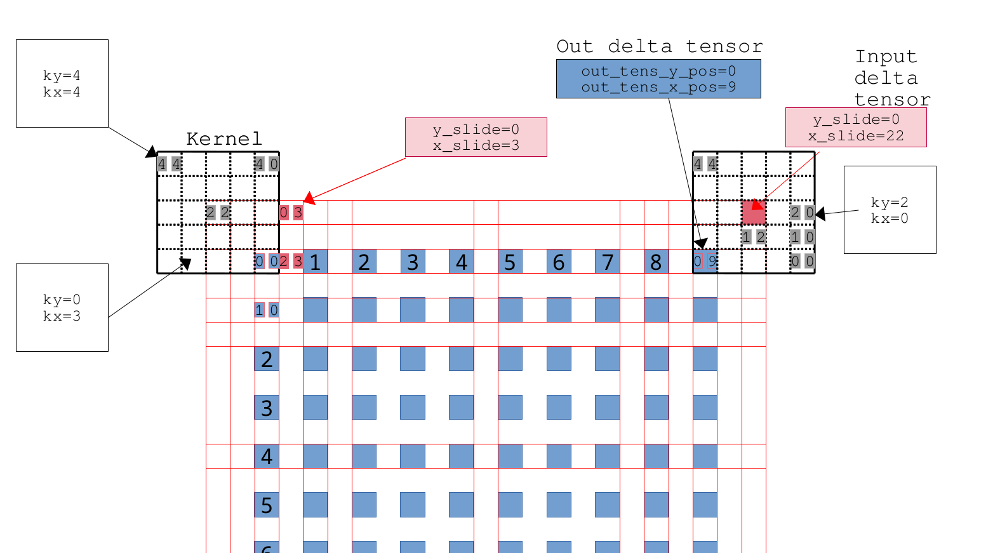
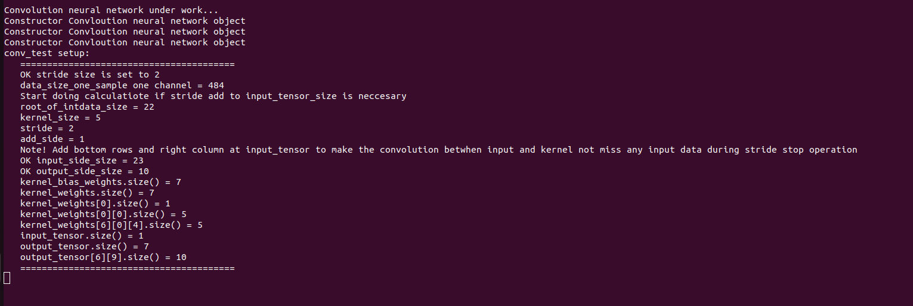
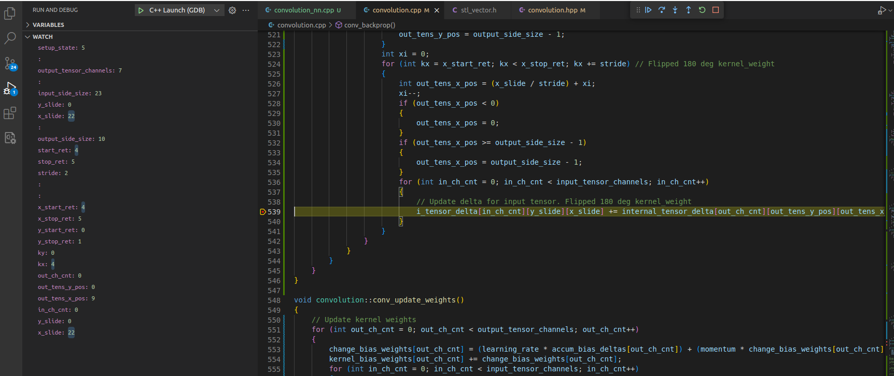

# Transpose part backpropagate output delta to input delta 

## part of void convolution::conv_backprop() function 

## Test on conv_test

    conv_test setup:
      ========================================
      OK stride size is set to 2
      data_size_one_sample one channel = 484
      Start doing calculatiote if stride add to input_tensor_size is neccesary
      root_of_intdata_size = 22
      kernel_size = 5
      stride = 2
      add_side = 1
      Note! Add bottom rows and right column at input_tensor to make the convolution betwhen input and kernel not miss any input data during stride stop operation 
      OK input_side_size = 23
      OK output_side_size = 10
      kernel_bias_weights.size() = 7
      kernel_weights.size() = 7
      kernel_weights[0].size() = 1
      kernel_weights[0][0].size() = 5
      kernel_weights[6][0][4].size() = 5
      input_tensor.size() = 1
      output_tensor.size() = 7
      output_tensor[6][9].size() = 10
      ========================================

